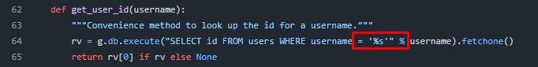
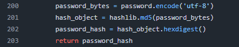
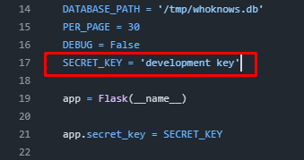
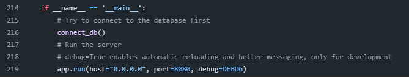
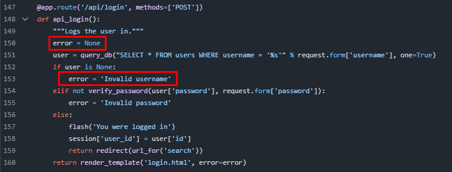

# Problems with the legacy codebase

**1. SQL Injection**

In the legacy code all of the queries are built with `%` instead of using `?` as placeholders. An example can be seen in the picture below.

This type of syntax using `%` is extremely vurnable to SQL Injections, where a person with malicious intent could do something like admin'-- or similar known SQL Injection methods, to gain access to a admin account etc.

**2. MD5 Password Encryption**

The MD5 encryption is extremely outdated and is not secure. One of the reasons is that *if* User1 and User2 uses the same exact passwords like "coolpassword", it would produce the same hash and could be something like "995ddff75421a80c6b932292422ab336" for both.

A newer and better solution could be using better encryption like BCrypt.

**3. Hardcoded secrets**

It is never a good idea to hardcode secrets like keys in this example, since we don't want people with malicious intent to take advantage of these. 

A fix for this could be something like putting all secrets or things you want to be kept hidden from public view in .env.

**4. No HTTPS in the code**

*Assuming this would be used in production* 

The code doesn't setup HTTPS and uses the default HTTP which is known to be a lot less secure than HTTPS since it sends everything in plain text. HTTPS adds encryption along the journey of the data traveling across the network.

In the picture example we can see theres a lack of addressing or setting up HTTPS. Although this can be done other places, so if its intentional ignore this problem.

**5. Lack of Error Handling**

In all of the code, there is a lack of error handling that could help catch an error that could crash the program. Instead things like `error = None` is used where the user only gets a string of `error = 'Invalid Password'`.

**6. One file**

The entire code is placed in one big file "app. py" instead of being spread out in folders for structure and readability.

**7. Lack of Tests**

There are no tests that are visible to us currently. Tests could help see if the code is working properly, which is extremely helpful since you'd rathe catch an error before it goes into production.

**8. Code Styling**

*Line 40* `sys.exit(1)` This function checks if the database exists, *but* if it doesn't it closes the entire program.

*Line 77* `g.db = connect_db` So before every request it checks the DB and runs `connect_db`, which runs `check_db_exists`. So every request has a chance to stop the entire program, if it doesn't find the DB.

*Line 1* `from datetime import datetime` is never actually used in the code.

*Line 188* `def logout():` instead of `api_logout` like all of the other api functions.

